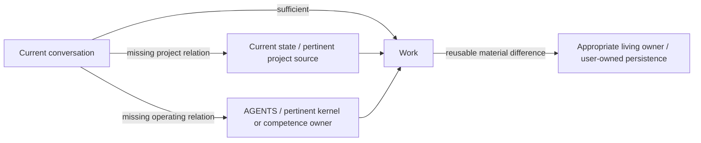

# kernel_chat

**Give a cloud chat a user-owned project harness: durable state, source-aware
reentry, situated competences, and revisable learning across conversations.**

`kernel_chat` extends the harness normally available to a local application or
agentic system into chat environments that do not own a persistent project
workspace. The chat stays direct when the current conversation is sufficient.
When a missing durable relation can change the result, the adapter gives the
host a path to a repository controlled by the user, where it can recover only
the state or source that matters when access is actually available.

[](VERSION)
[](LICENSE)
[](adapters/chatgpt/)

[Install in ChatGPT](INSTALL.md) · [User guide](docs/USER_GUIDE.md) ·
[Architecture](docs/ARCHITECTURE.md)

Source `0.5.1` is published on `main`. The latest tagged stable distribution is
`v0.5.0` until a separate `0.5.1` release is selected. Source publication,
tagged distribution, host installation and behavioral assimilation are
distinct facts.

> [!IMPORTANT]
> **ChatGPT activation requires a manual operator action.** If a coder or agent
> is adopting `kernel_chat` for you, generating the repository configuration is
> not enough. As soon as
> `adapters/chatgpt/CUSTOM_INSTRUCTIONS_CONFIGURED.md` exists, the coder must
> tell you that its complete text still has to be copied into ChatGPT Custom
> Instructions through the ChatGPT UI and saved. Until you confirm that step,
> the truthful status is **repository configured / host activation pending**.

## What changes

A long-running project should not become a transcript that every new chat must
reload. It needs a small current state, pointers to the sources that own the
truth, relevant ways of working, and a place for useful changes to survive.



The repository is the first persistence adapter. It is not the identity of the
kernel, and its contents are not automatic authority. Project sources continue
to own their truth; the user continues to own external effects.

## Quick start

You need Python 3, a GitHub account, and a ChatGPT account where the required
GitHub access and Custom Instructions are available.

1. Fork this repository and clone your fork.
2. Configure the ChatGPT adapter and initialize your first project:

   ```bash
   python scripts/configure.py \
     --github-user YOUR_GITHUB_USER \
     --repository YOUR_REPOSITORY \
     --project-name "YOUR PROJECT" \
     --project-source "https://github.com/YOU/YOUR_PROJECT"
   ```

   The command creates the local configured adapter and project-state files.
   It does **not** install anything into the ChatGPT account. If a coder or
   agent is performing the setup, it must surface the required UI action to
   the operator immediately at this point.

3. Commit the generated project state to your fork:

   ```bash
   git add state/CURRENT.md state/SOURCES.md
   git commit -m "Initialize kernel_chat state"
   git push
   ```

4. **Operator action — activate the ChatGPT host.**

   - Open `adapters/chatgpt/CUSTOM_INSTRUCTIONS_CONFIGURED.md`.
   - Copy its complete text into ChatGPT Custom Instructions from the ChatGPT UI.
   - Save the instructions.
   - Connect the same ChatGPT account to the GitHub fork with only the access
     you intend.
   - Confirm to the coder or setup process that the UI step was completed.

5. Verify reachability in a new chat. Ask ChatGPT to open
   `state/CURRENT.md` from your fork. When a kernel method is needed, the host
   should be able to reach `AGENTS.md` and then only the pertinent owner.

If the project state is not accessible, repository configuration may be valid
while host access is still unavailable. Fix that boundary before relying on
continuity.

The configured Custom Instructions file is local and ignored by Git. It stores
no token. The state files are meant to be committed because they are the
user-owned continuity surface.

### Adoption status

Keep these states separate:

```text
repository configured
-> host activation pending

operator saves configured instructions in the ChatGPT UI
-> host instructions installed (operator-confirmed)

new chat reaches configured state / pertinent owner
-> host reachability observed

later real use changes behavior as intended
-> behavioral assimilation evidence
```

A coder should not collapse these states into a generic “installed” claim.

## What the kernel carries

- **Present-first work.** A bounded request remains bounded; repository reentry
  is selective, not ceremonial.
- **Source-aware continuity.** Current state points to owner-native sources
  instead of copying whole projects or chat histories.
- **Situated competence.** A competence or metacompetence participates when it
  can change the result. Its result may call another competence, form a
  temporary composition or correct an earlier method; the catalogue is not
  a ceiling. Competences can grow from knowledge, intent and possibility.
- **Semantic comprehension.** Stored rules, reports, state and previous
  solutions are understood through their function and still-valid reasons;
  persistence does not make them automatic present truth or method.
- **Self-observation.** The kernel can notice when its own interpretation is
  narrowing the field and revise that closure before it becomes structure.
- **Revisable evolution.** Real use can leave a small, attributable change in
  state, an adapter, a competence relation, or the kernel itself.
- **Operational continuity.** Unfinished flows, bounded requests and results,
  effect receipts, and recovery can remain continuable without implying a
  background runtime.
- **Exact effect boundaries.** Capability, source access, ownership, and
  authority remain distinct when a material external effect appears.

The portable relations live under [`kernel/`](kernel/). The first host adapter
lives under [`adapters/chatgpt/`](adapters/chatgpt/). User state is created
under [`state/`](state/) by the configurator.

## What exists now

Source version `0.5.1` provides:

- a host-neutral kernel contract;
- competence and metacompetence participation;
- semantic comprehension of represented knowledge;
- the FDLA self-observation and choice function;
- a ChatGPT Custom Instructions adapter;
- first-project state initialization;
- separate selective entry to project context and kernel operating knowledge;
- practical user-owned competence cultivation and learning in its actual owner;
- adapter preview and explicit replacement, preserving configured files by default;
- an explicit coder-to-operator handoff for the manual ChatGPT UI activation;
- optional operational continuity for unfinished work, requests/results,
  receipts, replay protection, and recovery;
- dependency-free structural validation and configuration regression tests.

Run:

```bash
python scripts/validate.py
python -B -m unittest discover -s tests -v
```

The validator checks repository structure and configured artifacts. The tests
exercise local configuration behavior, including preservation and the adoption
handoff emitted by the configurator. CI runs both checks on Windows and Linux.
These checks do not simulate ChatGPT, prove connector availability, install
account instructions or establish model assimilation.

ChatGPT is the first implemented adapter. Other cloud-chat adapters remain
possible but are not claimed by this source version.

## Development direction

`kernel_chat` is a practical continuity package and an evolving logical
harness. Its longer direction is an autopoietic AI architecture able to retain
operational identity, observe its own functioning, integrate useful
competences, and revise its organization without losing provenance,
reversibility, or human authority over effects.

That direction is not a claim that this release is autonomous or generally
intelligent. It identifies what the present foundation is intended to make
possible through observable use and continued development.

## Documentation

- [Installation](INSTALL.md)
- [User guide](docs/USER_GUIDE.md)
- [Architecture](docs/ARCHITECTURE.md)
- [ChatGPT adapter](adapters/chatgpt/README.md)
- [Operational continuity](operations/CURRENT.md)
- [Lineage and migration](docs/LINEAGE.md)
- [Current project state](CURRENT_STATE.md)
- [Package evolution guide](docs/EVOLUTION_GUIDE.md)
- [Changelog](CHANGELOG.md)

## License

Copyright 2026 Graziano Guiducci. Licensed under the
[Apache License 2.0](LICENSE).
