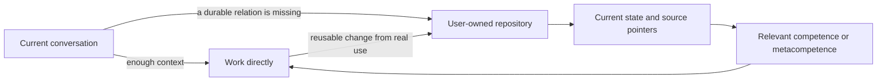

# kernel_chat

**Give a cloud chat a user-owned project harness: durable state, source-aware
reentry, situated competences, and revisable learning across conversations.**

`kernel_chat` extends the harness normally available to a local application or
agentic system into chat environments that do not own a persistent project
workspace. The chat stays direct when the current conversation is sufficient.
When a missing durable relation can change the result, the adapter gives the
host a path to a repository controlled by the user, where it can recover only
the state or source that matters when access is actually available.

[](VERSION)
[](LICENSE)
[](adapters/chatgpt/)

[Install in ChatGPT](INSTALL.md) · [User guide](docs/USER_GUIDE.md) ·
[Architecture](docs/ARCHITECTURE.md)

## What changes

A long-running project should not become a transcript that every new chat must
reload. It needs a small current state, pointers to the sources that own the
truth, relevant ways of working, and a place for useful changes to survive.



The repository is the first persistence adapter. It is not the identity of the
kernel, and its contents are not automatic authority. Project sources continue
to own their truth; the user continues to own external effects.

## Quick start

You need Python 3, a GitHub account, and a ChatGPT account that can access your
GitHub repository.

1. Fork this repository and clone your fork.
2. Configure the ChatGPT adapter and initialize your first project:

   ```bash
   python scripts/configure.py \
     --github-user YOUR_GITHUB_USER \
     --repository kernel_chat \
     --project-name "YOUR PROJECT" \
     --project-source "https://github.com/YOU/YOUR_PROJECT"
   ```

3. Commit the generated project state to your fork:

   ```bash
   git add state/CURRENT.md state/SOURCES.md
   git commit -m "Initialize kernel_chat state"
   git push
   ```

4. Copy the complete text from
   `adapters/chatgpt/CUSTOM_INSTRUCTIONS_CONFIGURED.md` into ChatGPT Custom
   Instructions and connect the same ChatGPT account to your GitHub fork.
5. In a new chat, ask ChatGPT to open `state/CURRENT.md` from your fork. If it
   cannot, review the GitHub connection before relying on continuity.

The configured Custom Instructions file is local and ignored by Git. It stores
no token. The state files are meant to be committed because they are the
user-owned continuity surface.

## What the kernel carries

- **Present-first work.** A bounded request remains bounded; repository reentry
  is selective, not ceremonial.
- **Source-aware continuity.** Current state points to owner-native sources
  instead of copying whole projects or chat histories.
- **Situated competence.** A competence or metacompetence participates when it
  can change the result. Its result may call another competence, form a
  temporary composition or correct an earlier method; the catalogue is not
  a ceiling. Competences can grow from knowledge, intent and possibility.
- **Self-observation.** The kernel can notice when its own interpretation is
  narrowing the field and revise that closure before it becomes structure.
- **Revisable evolution.** Real use can leave a small, attributable change in
  state, an adapter, a competence relation, or the kernel itself.
- **Operational continuity.** Unfinished flows, bounded requests and results,
  effect receipts, and recovery can remain continuable without implying a
  background runtime.
- **Exact effect boundaries.** Capability, source access, ownership, and
  authority remain distinct when a material external effect appears.

The portable relations live under [`kernel/`](kernel/). The first host adapter
lives under [`adapters/chatgpt/`](adapters/chatgpt/). User state is created
under [`state/`](state/) by the configurator.

## What exists now

Version `0.5.0` provides:

- a host-neutral kernel contract;
- competence and metacompetence participation;
- the FDLA self-observation and choice function;
- a ChatGPT Custom Instructions adapter;
- first-project state initialization;
- separate selective entry to project context and kernel operating knowledge;
- practical user-owned competence cultivation and learning in its actual owner;
- adapter preview and explicit replacement, preserving configured files by default;
- optional operational continuity for unfinished work, requests/results,
  receipts, replay protection, and recovery;
- a dependency-free structural validator.

Run:

```bash
python scripts/validate.py
python -B -m unittest discover -s tests -v
```

The validator checks this repository's structure and configured artifacts. It
does not simulate ChatGPT or prove that a connector is available in a specific
account. The regression tests exercise local configuration; CI runs both checks
on Windows and Linux. ChatGPT is the first implemented adapter; other cloud-chat
adapters remain possible but are not claimed by version `0.5.0`.

## Development direction

`kernel_chat` is a practical continuity package and an evolving logical
harness. Its longer direction is an autopoietic AI architecture able to retain
operational identity, observe its own functioning, integrate useful
competences, and revise its organization without losing provenance,
reversibility, or human authority over effects.

That direction is not a claim that this release is autonomous or generally
intelligent. It identifies what the present foundation is intended to make
possible through observable use and continued development.

## Documentation

- [Installation](INSTALL.md)
- [User guide](docs/USER_GUIDE.md)
- [Architecture](docs/ARCHITECTURE.md)
- [Operational continuity](operations/CURRENT.md)
- [Lineage and migration](docs/LINEAGE.md)
- [Current project state](CURRENT_STATE.md)
- [Package evolution guide](docs/EVOLUTION_GUIDE.md)
- [Changelog](CHANGELOG.md)

## License

Copyright 2026 Graziano Guiducci. Licensed under the
[Apache License 2.0](LICENSE).
