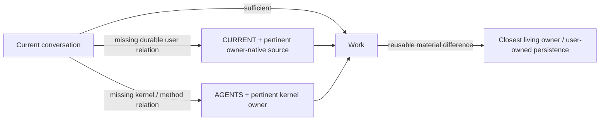

# kernel_chat

**Give a cloud chat a user-owned continuity kernel: durable context, source-aware
reentry, situated competences, and revisable learning across conversations.**

`kernel_chat` extends the continuity normally available to a local application
or agentic system into chat environments that do not own a durable workspace.
The chat stays direct when the current conversation is sufficient. When a
missing durable relation can change the result, the host can selectively reach
a user-owned instance, recover only the state or owner-native source that
matters, and continue without turning the whole repository into permanent
prompt context.

A project is optional. The kernel instance can exist before any project is
selected, and later projects become contexts and sources of the user-owned
continuity rather than the identity of the kernel itself.

[](LICENSE)
[](adapters/chatgpt/)

[Source version](VERSION) · [Install / adopt](INSTALL.md) ·
[Adoption model](docs/ADOPTION_GUIDE.md) · [User guide](docs/USER_GUIDE.md) ·
[Architecture](docs/ARCHITECTURE.md) · [External review brief](docs/EXTERNAL_REVIEW_0_6_0.md) · [Contributing](CONTRIBUTING.md)

`VERSION` identifies the current source package. Tagged releases, a configured
user instance, an operator-confirmed installed bridge, repository reachability
and behavioral assimilation are distinct facts.

## What changes

A long-running relation should not become a transcript that every new chat must
reload. It needs a small current state, pointers to sources that own the truth,
reachable ways of working, and a place for useful changes to survive.



The repository is the first persistence adapter. It is not the identity of the
kernel, and its contents are not automatic authority. Connected project/domain
sources continue to own their truth; the user continues to own external
effects.

## Three ways to approach the package

### Study it

You can inspect the public package, architecture and kernel owners without
configuring anything. Reading the repository does not install `kernel_chat` or
change a ChatGPT account.

### Create a private user-owned instance

When continuity state should not be public, create a **private standalone
repository** initialized from an identified `kernel_chat` source/release. A
public GitHub repository cannot become a private fork.

### Create a public user-owned instance

When its state is deliberately public, a normal public fork is valid.

See [the adoption guide](docs/ADOPTION_GUIDE.md) for the distinction between
package, user instance, configured bridge and installed host.

## Quick start

You need Python 3.11–3.14, a GitHub account, and a ChatGPT account where the required
repository access and Custom Instructions are available.

After creating your user-owned repository, configure the ChatGPT bridge and
continuity state **without requiring a project**:

```bash
python scripts/configure.py \
  --github-user YOUR_GITHUB_USER \
  --repository YOUR_REPOSITORY
```

To select an initial project/context, provide both optional arguments:

```bash
python scripts/configure.py \
  --github-user YOUR_GITHUB_USER \
  --repository YOUR_REPOSITORY \
  --project-name "YOUR PROJECT" \
  --project-source "https://github.com/YOU/YOUR_PROJECT"
```

The command prepares:

```text
state/INSTANCE.json
  instance/package/bridge identity and source-contact observation

state/CURRENT.md
  current relation/context

state/SOURCES.md
  owner-native sources and their role

adapters/chatgpt/CUSTOM_INSTRUCTIONS_CONFIGURED.md
  local generated bridge; intentionally ignored by Git
```

Commit the user-owned state you intend to persist:

```bash
git add state/INSTANCE.json state/CURRENT.md state/SOURCES.md
git commit -m "Initialize kernel_chat continuity"
git push
```

### Operator action — activate ChatGPT

Repository configuration does **not** install anything in ChatGPT.

1. Open `adapters/chatgpt/CUSTOM_INSTRUCTIONS_CONFIGURED.md`.
2. Copy its complete text into ChatGPT Custom Instructions.
3. Save it.
4. Connect the same ChatGPT account to the user-owned repository with only the
   access you intend.
5. Confirm that the UI step was completed.

After the operator actually copied/saved the current configured bridge, persist
that operator-reported receipt for the exact configured bytes:

```bash
python scripts/configure.py \
  --github-user YOUR_GITHUB_USER \
  --repository YOUR_REPOSITORY \
  --confirm-host-installation
```

This snapshots the SHA-256 digest of the **raw configured bridge bytes**, the
bridge repository target when observable, and configured-template provenance
when known. It does not inspect ChatGPT directly. If the local bridge has drifted
from its persisted configured receipt, confirmation stops instead of silently
accepting that drift.

The confirmation changes `state/INSTANCE.json` locally. Publish that receipt
before relying on a new remote conversation:

```bash
git add state/INSTANCE.json
git commit -m "Record ChatGPT host installation receipt"
git push
```

Read the pushed `state/INSTANCE.json` back from the remote repository (or with
`git show @{upstream}:state/INSTANCE.json`) and confirm that it contains
`installed_operator_confirmed` before treating the receipt as remotely
available.

Until the operator confirms the copy/save, the truthful state is:

```text
repository configured / host activation pending
```

Then verify reachability in a new conversation. The host should be able to
reach `state/CURRENT.md` when durable context matters and `AGENTS.md` plus the
pertinent kernel owner when operating knowledge matters. Reachability is not
proof of later assimilation.

## State is separated by function

```text
INSTANCE
  which package / bridge relation this user-owned instance currently records
  + source-contact observations
  + configured bridge byte identity / semantic target when known
  + the last operator-confirmed installed bridge identity/target, when known

CURRENT
  where the user's current relation/context is now

SOURCES
  which owner-native sources can change the result

operations/
  optional unfinished causal/effect continuity
```

Within `INSTANCE`, the bridge template currently available from the package is
kept distinct from the provenance of the preserved configured bridge. A legacy
bridge can therefore be retained with `configured_bridge_template_version =
unknown` instead of being retroactively relabelled as current.

A standard configured bridge also embeds the user-owned repository it reaches.
Legacy migration refuses a known repository mismatch before writes rather than
creating an instance receipt that points somewhere different from the preserved
bridge.

The operator-confirmed installed identity is separate again. It preserves the
confirmed raw-byte digest plus the bridge target/provenance snapshot when
available. If the local configured bridge changes later, validation can expose
that difference without rewriting the last host confirmation.

## Package updates do not imply host updates

The ChatGPT bridge has its own template version. A package update can leave the
configured and installed bridge unchanged.

```text
package source update
!= bridge template currently available in the package
!= configured bridge template provenance
!= configured bridge repository / bytes
!= operator-confirmed installed bridge incarnation receipt
!= actual host behavior
```

After a package update, `--refresh-instance` can refresh package identity and
the bridge template currently available while preserving configured-bridge
identity/provenance, source-contact and host observations. It observes local
bridge drift but does not accept changed bytes as the new configured
incarnation. In an existing instance, missing `CURRENT` or `SOURCES` remain
missing during refresh; use an explicit state replacement when restoration or
re-initialization is actually selected. Use `--preview-adapter` before any selected bridge replacement.
`--replace-adapter` regenerates the local configured file from the current
template and can therefore establish its byte identity, target and provenance;
for an existing INSTANCE it does **not** migrate `instance_repository`.
The operator must still copy/save a selected replacement in ChatGPT, then run
`--confirm-host-installation` again.

User-owned `CURRENT`, `SOURCES`, competences and local learning are preserved by
default. See [the adoption guide](docs/ADOPTION_GUIDE.md) for legacy migration
and evidence-state details.

## Feedback and source contact

`state/INSTANCE.json` can remember the last observed upstream revision/time and
whether a material delta was seen. `AGENTS.md` owns the light policy for when a
source check is useful. No timer, daemon or automatic update is created.

When real use produces informative friction, failure, unexpected success or a
new possibility, a coder can prepare compact **Evolution Feedback**. Public
submission always requires operator consent. Use a GitHub Issue for observed
feedback; use a focused fork + Pull Request for a concrete public-source change.

See [CONTRIBUTING.md](CONTRIBUTING.md).

## What the kernel carries

- **Present-first work.** A bounded request remains bounded; repository reentry
  is selective, not ceremonial.
- **Source-aware continuity.** Current state points to owner-native sources
  instead of copying whole histories.
- **Situated competence.** Competences can participate, compose and develop from
  intent, knowledge, memory, success, possibility or a gap.
- **Situated movement.** The present field can resolve to use/preserve, compose,
  adapt/deepen, form, defer/preserve unknown, or `no_change` without a central
  chooser or mandatory decision pipeline.
- **Mobile observation.** When the current frame may itself hide a material
  relation, the kernel can keep the object fixed, move observation through a
  different pertinent causal position, and return with a changed resultant or
  `no_change` without imposing a mandatory multi-view pass.
- **Claim/proof integrity.** Stronger claims such as exact identity, support,
  immutable provenance or completion remain distinct from the evidence that
  proves them; common-mode agreement is not automatically independent proof.
- **Semantic comprehension.** Stored representations are understood through
  source, function, observation frame, transformation and still-valid reasons.
- **Semantic / operational distinction.** A relation, its persistent
  incarnation, effect authority, actual effect and observed consequence remain
  distinguishable.
- **Self-observation.** FDLA can correct a closure introduced by the acting
  interpretation without turning into a mandatory preliminary workflow.
- **Revisable evolution.** Real use can change the closest owner and later
  readback can revise or retire a stale incarnation.
- **Operational continuity.** Unfinished flows, requests/results, receipts and
  recovery can remain continuable without implying a background runtime.
- **Exact effect boundaries.** Capability, access, ownership and authorization
  remain distinct.

The portable relations live under [`kernel/`](kernel/). The first host adapter
lives under [`adapters/chatgpt/`](adapters/chatgpt/). User state lives under
[`state/`](state/).

## Verification

Run:

```bash
python scripts/validate.py
python -B -m unittest discover -s tests -v
```

The validator checks package structure and configured artifacts. The current
suite contains **38 regression cases**: 25 configurator cases and 13 validator /
drift / provenance / reachability cases. It includes a source-bound real 0.5.3 migration shape,
legacy/custom target handling, raw-byte LF/CRLF identity, additive v1 receipt
compatibility, refresh/confirm/replacement effect boundaries, missing-local-
bridge handling, configured/installed semantic identity and host-adoption
boundaries. CI exercises every declared supported line — Python **3.11, 3.12, 3.13 and 3.14** — on both Ubuntu and Windows. These checks do not simulate ChatGPT, prove connector
availability, independently verify the UI copy/save, or establish behavioral
assimilation.

ChatGPT is the first implemented adapter. Other cloud-chat adapters remain
possible but are not claimed by the current source.

## Development direction

`kernel_chat` is a practical continuity kernel and an evolving logical harness.
Its longer direction is an autopoietic AI architecture able to retain
operational identity, observe its own functioning, integrate useful
competences, and revise its organization without losing provenance,
reversibility, or human authority over effects.

That direction is not a claim that the current source is autonomous or
generally intelligent. It describes what the present foundation is intended to
make increasingly possible through observable use and continued development.

## Documentation

- [Installation](INSTALL.md)
- [Adoption guide](docs/ADOPTION_GUIDE.md)
- [User guide](docs/USER_GUIDE.md)
- [Architecture](docs/ARCHITECTURE.md)
- [External review brief — 0.6.0](docs/EXTERNAL_REVIEW_0_6_0.md)
- [ChatGPT adapter](adapters/chatgpt/README.md)
- [Contributing](CONTRIBUTING.md)
- [Evolution Feedback template](.github/ISSUE_TEMPLATE/evolution-feedback.md)
- [Operational continuity](operations/CURRENT.md)
- [Lineage](docs/LINEAGE.md)
- [Package current state](CURRENT_STATE.md)
- [Package evolution guide](docs/EVOLUTION_GUIDE.md)
- [Changelog](CHANGELOG.md)

## License

Copyright 2026 Graziano Guiducci. Licensed under the
[Apache License 2.0](LICENSE).
